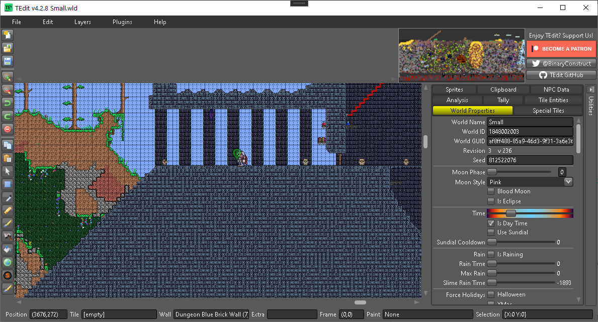

# TEdit Documentation


To download TEdit visit [https://github.com/TEdit/Terraria-Map-Editor/releases/latest](https://github.com/TEdit/Terraria-Map-Editor/releases/latest).


TEdit - Terraria Map Editor is a stand alone, open source map editor for Terraria. It lets you edit maps just like paint! It also lets you change world settings, time, bosses downed, edit chests, sign, make epic dungeons, castles, cities, and add rewards for your adventurers!


See [Install Requirements](install-requirements.md) if you are having problems with sprites, textures or other application issues.


New to TEdit?  See the [Getting Started](basics/getting-started.md) sections.

Are you a pro looking for more tips? Try out [Plugins ](plugins/plugins.md)or [Clipboard](sidebar-tools/clipboard.md).

