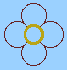

# Active Tray

The active tray is what appears at the top when you select a tool. Most tools will use the Paint Mode Tray and some will also use the Size Tray. The sprites tool will use the Sprites Tray.

## Paint Mode Tray

In the top left of the tray is the eraser toggle. When this is toggled on \(gold background\) you will erase whatever paint mode type you currently have selected instead of painting.

Below the eraser is the Paint Mode dropdown menu. This is where you can select between painting tiles, walls, tiles and walls at the same time, wire, or liquids.

To the right of the tray you will see the current Tile/Wall boxes if appropriate, or the liquid options.

### Tile/Wall Boxes

These boxes appear when you have tile and/or walls selected. The Tile/Wall dropdown menu is what is currently chosen to be painted. For example, if you want to paint dirt blocks you would pick dirt block here. The number on the right is of each selection is the tile/wall ID.

The dropdown menu named Mask Mode has three selections: Disable Mask, Edit Empty Tiles, Edit Matching Tiles. This remains true for walls as well, but the second and third options do actually match empty walls and matching walls respectively instead.

The dropdown menu named Mask has all the same choices as the tile/wall type. This is where you choose what you want to use as your mask.

Masking is maybe easier shown than explained, however, I shall try to explain it. If the Mask Mode is set to “Edit Matching Tiles” the mask will only let you paint/erase **over** whatever tile/wall type is chosen as the mask. It is like putting cardboard over every other tile/wall type that is not chosen so that they will be protected from the paint. If the Mask Mode is set to “Edit Empty Tiles” then the mask will only let you paint tiles/walls over empty spaces. If the Mask Mode is set to “Disable Mask” then you can paint/erase anywhere you like \(barring other restrictions such as if the [Selection Tool](toolbar.md#selection-tool-s) is currently in place somewhere\).

## Size Tray

As you can probably tell, this tray determines the size of the painting template. This is used for the brush and morph tools.

The Width row is for determining the horizontal size, or the magnitude of the x-axis for those familiar with such things. The numbers refer to the number of blocks. A single dirt block would have a width of 1. Twenty dirt blocks side-by-side would have a width of 20. You can either type the number in and click somewhere else on the tray \(enter doesn't work\), or use the slider.

The Height row is for determining the vertical size, or the magnitude of the y-axis. The numbers work the same way as they do for the width.

At the end of both of these rows is the “Square Width and Height” toggle. This toggle is defaulted to on \(gold background\) and will make the height and the width always be the same number, thus producing a square template. If you turn it off you can change the width and height independently of each other.

The Outline row turns your solid shape into a hollowed-out shape, with the thickness of the solid border being the number shown. The box at the end of the row is the toggle for turning this feature on/off. Try it out to get a better idea.

The dropdown menu at the bottom is the shape. Currently you can choose between rectangle and ellipse. These are pretty self explanatory, but the shapes may not be perfect if the size is too small.

## Other

The point tool uses just a simple dropdown menu. There isn't much to say about this other than that the dropdown menu for the point tool will show only what makes sense at that time - i.e., No nurse? No option to move the nurse. See the [World Properties](../sidebar-tools/world-properties.md) page for adding NPCs.

The morph tool does use the Size tray but it does not use the Paint Mode tray. Instead it has a dropdown menu to choose from what you want to paint.

