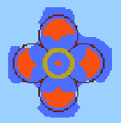

# Components

The Terraria world is made up of a variety of things. Unlike Terraria itself, TEdit can place these things pretty much anywhere in the map and will not try to restrict you. However, when the map is loaded up in Terraria the game will sort these out one way or another - gravity-adhering blocks and liquids will be settled, while sprites will break \(drop as an item\) if there is nothing solid underneath them.

## Background Walls

[Background walls](http://terraria.gamepedia.com/Wall) are the walls that are present in the background of a house, dungeon, in the dirt layer above the surface \(above 0ft\), etc. For a house to be considered a house and for NPCs to move in, to stop mob spawns, and to set a bed, player-placed background walls must be present. Background walls are on their own layer, and interfere with nothing else.

## Tiles

Tiles are the [blocks](http://terraria.gamepedia.com/Block) that make up the world. They differ from sprites in that they are always of size 1x1 and are usually “solid”, completely inhibiting movement. However, actuators can be used to make tiles non-solid too by toggling the tile to an “inactive” state.

## Liquids

[Liquids](http://terraria.gamepedia.com/Liquids) partially inhibit movement by slowing down the player when moving through them. Note that lava can destroys many sprites and is dangerous to the player.

As mentioned in the intro, in the editor you can place liquids in places they normally would not be and they will stay there. However, once you load up the map in the game they will adhere to gravity and fall down if they can, as well as destroying things if lava \(where applicable\). If you want them to stay where you placed them in the editor you must also contain them there as you would in game.

As mentioned, liquids can only be painted where there are no tiles. You can not overwrite tiles with liquids in the editor - you must erase the tiles first. However, liquids will draw over other liquids. Note how in this picture the tiles have not been changed when painted over with liquids:

## Sprites

Sprites take on the roles of objects in the game rather than pieces of the terrain; tables, chairs, trees, flowers, etc. This means they tend to act like they are in the background and do not inhibit movement.

Mechanically they exist on the same layer as tiles and liquids, meaning they can not “share” space with tiles \(or indeed, other sprites\), but unlike tiles they can share share space with a liquid.

## Wire

There are \(currently\) four differently coloured [wires](http://terraria.gamepedia.com/Wire); red, blue, green, and yellow. Each type of wire is on its own layer and does not interfere with each other \(although they can visually obscure each other\). They can be placed anywhere without restrictions both in the editor and Terraria and they do not adhere to gravity.

Wires have distance limitations when connecting things \(I've heard varying limitations of 1000, 2000 and 3000 units; I am not sure which one is correct, although the official Terraria wiki says 2000\), so keep that in mind.

When connecting wires to tiles/sprites make sure they share at least one space together or they wont be counted as connecting.

## Actuators

[Actuators](http://terraria.gamepedia.com/Actuator) can be used to toggle the state of a tile \(but not sprites\). This makes the tile they are placed on non-solid when toggled \(using wire and a switch of some form\). They exist on a separate layer to anything else and can be placed with no restrictions, just like wires.

## Points

Points are a little different than the rest. You wont see points in Terraria because they are invisible. Nevertheless, points are just as important and they can be used to shape your world in different ways.

Points refer to the location on the map that something happens. This may be the point where the nurse sleeps. It may be the point where the dungeon starts. It could even be the point where your friends enter the world for the first time to fall to their death or start off their adventures.

## World Sizes

These are the default world sizes and background layer levels.

| Size | Width | Height | Surface BG | Cavern BG |
| :--- | :--- | :--- | :--- | :--- |
| Small | 4200 | 1200 | 336 | 462 |
| Medium | 6400 | 1800 | 444 | 624 |
| Large | 8400 | 2400 | 648 | 954 |

