# Toolbar

The tool section is located on the left of the editor.

## Arrow Tool \[A\]

The arrow tool looks like an arrow cursor, the same as the one your used to using when using your computer.

With the arrow tool selected it is impossible to make any accidental changes to the map and it should only display a 1x1 template. This make the arrow tool useful for getting information from individual tiles via the [Information Bar](Information%20Bar), which is displayed in the bottom left corner.

With the arrow tool selected you can also right-click on chests and signs to see what is inside and edit them. See the [Chest Editor](Chest%20Editor) page for more details.

## Selection Tool \[S\]

The selection tool looks like a blue square.

When using this tool you can select a section of the map \(as a rectangle\) by holding down left-click. You can also further expand the area you've already selected by holding Shift+left-click and dragging. If you want to clear the rectangle you can do so by right-clicking somewhere on the map while the selection tool is selected or using Ctrl+D. You can also load your previous selection with Ctrl+right-click, and can even use Shift+left-click and drag to expand it.

Here is a selection rectangle drawn in some empty space/air:

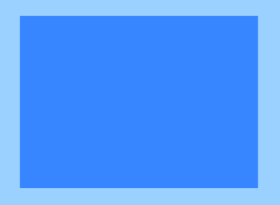

While there is a selection rectangle present painting can only be done inside that area; if you want to paint elsewhere you must first remove the rectangle. You can do this by right-clicking when you are using the tool.

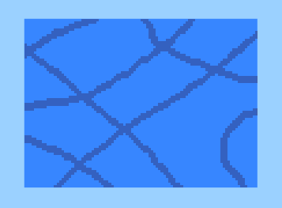

This tool is also used to copy part of the map. To do this select what you want to copy, then use the copy button on the toolbar, the copy function in the menubar, or press Ctrl+C.

## Picker Tool

Also known as eye dropper, this tool "picks" things you click on. Things include tiles, walls, and liquids. Oddly, you can "pick" sprites too but they wont be placable with the sprite tool but instead with the pencil or brush! Probably a bug to be squashed.

If you right-click on things it will pick them for the mask.

The picker tool uses the [Paint Mode](Active-Tray#wiki-Paint_Mode_Tray) to show what you have picked.

## Pencil Tool \[E\]

The pencil tool looks like a pencil.

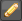

The pencil tool paints only one tile at a time. This makes it exceptionally useful for painting fine details or irregular shapes.

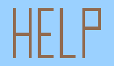

* **Left Mouse Button**: you will have free drawing - i.e. you can draw in any way you like.
* **Hold Right Mouse Button**: you can draw a straight horizontal line, perfect for bridges, tunnels, buildings, etc.
* **Hold Left AND Right Mouse Button**: at the same time you can draw vertical straight lines. 

### Line Drawing

* Click start position, hold shift, click end position

  You can also draw a line from one point to another by clicking your starting point, holding Shift and clicking on your end point.

The pencil tool uses the [Paint Mode Tray](Active-Tray#wiki-Paint_Mode_Tray) to select what you paint.

## Brush Tool \[B\]

The brush tool looks like a brush.

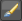

The brush tool can paint a wide area of blocks.

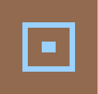

Like the pencil tool, straight lines can be drawn horizontally \(right-click\) and vertically \(left-click + right-click\). You can also use the same Shift + left-click method for drawing point-to-point lines

The brush tool uses the [Paint Mode Tray](Active-Tray#wiki-Paint_Mode_Tray) to select what you paint and the [Size Tray](Active-Tray#wiki-Size_Tray) to select the size and shape of your brush strokes.

## Fill Tool \[F\]

The fill tool looks like tipped bucket with paint coming out.

The fill tool replaces tiles/walls/liquids/emptyspace with other tiles/walls/liquids. Currently, you can do a contiguous fill. This means that all tiles/walls/liquids/whatever of the type you have clicked on will be replaced as long as there is a connection to the original.

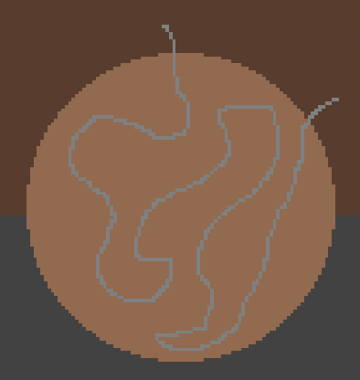

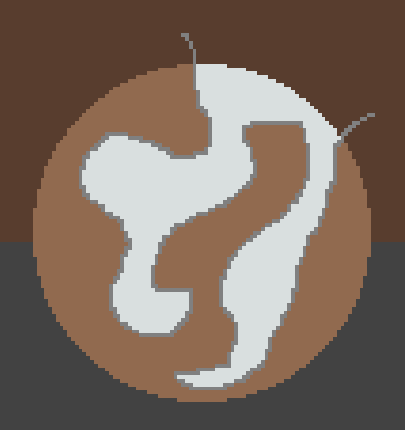

You can also use the selection tool to contain a fill action.

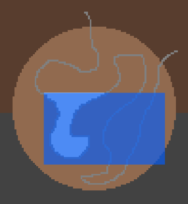

The fill tool use the [Paint Mode Tray](Active-Tray#wiki-Paint_Mode_Tray) to select what to paint.

## Point Tool \[P\]

This tool looks like a world.

This tool places points on the map by chooses the point from the drop down menu and left-clicking on the map where you want it. The points that the tool places look like this on the map:

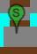

The spawn point is where people first load up \(if they have not set a bed\). This tool is useful if your town is not near the default spawn point, or if you are doing a custom map and want them to start in a particular place. Make sure it is not placed on/near any tiles you wish to keep however, since the game destroys any tiles \(but not sprites or walls\) that are located at the spawn point when someone enters the game there.

The dungeon point is where the dungeon is located. I am not sure what exactly that does \(the terrain determines the enemy type but perhaps for dungeons you also need the dungeon point?\). I know it used to mean where the Old Man patrolled but he seemingly has his own point now. Best put this point at the start of the dungeon \(if you have one\). It may set the spawn of the Cultists that activate the Lunar Events, but I don't know for sure.

The NPC points are the points where those NPCs sleeps at night and tends to patrol during the day. The NPC points will appear in the dropdown menu only as appropriate, i.e., if you have no nurse there isn't much point in having her point in the menu \(no pun intended\).

The Old Man point is particularly useful as you can have him spawn in or near an arena you have built especially to fight his alter ego. He could even have his own room in your base if you so choose, but I wouldn't recommend talking to him at night!

## Sprite Placer Tool \[T\]

This tool looks like a black square with an 'S' in the middle.

The sprite placer tool is used with the panel on the right of the editor to place sprites. While most sprites can only be placed one at a time, small, 1x1 sprites such as grasses and platforms can be drawn in strokes, much like when using the pencil or brush tools. And like those tools, you can use the same straight line drawing functions for drawing horizontal \(right-click\), vertical \(left-click + right-click\) or point-to-point \(Shift + left-click\) lines.

Use the drop down to select a tile type, then the grid to select a style. All styles should be available.

1. Select the sprite tool.
2. Type a filter in the sprite tab.
3. Select the tile type.
4. Select the tile style.
5. place the tile in the map.

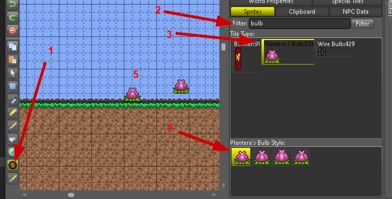

## Morph Tool

The morph tool will change whatever it is used on into the biome that is selected in the dropdown menu. It will only paint over existing tiles/walls and not empty spaces. It will only change certain types of types of tiles/walls, leaving things like ore untouched. Edge tiles will be converted into grass if applicable.

The tool will work differently at different heights. Try it out! Note that if you create enough of a biome the music will change to that biome type and monsters of that biome will spawn.

The morph tool uses the \[\[/Active-Tray\#wiki-Size\_Tray Size Tray\]\] to select the size and shape of your brush strokes, and also uses the same line-drawing functions as the pencil and brush tools.

