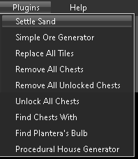

# Plugins

## Settle Sand

This makes all sand fall in the world.

## Simple Ore Generator

This uses the selected tile to randomly place "ore nodes" throughout the map, below the surface level.

## Replace All Tiles

This replaces all tiles one type with another.

## Remove All Chests

This deleted all chests from the world.

## Remove All Unlocked Chests

This deletes all chests that are not locked.

## Unlock All Chests

This replaces all locked chests with their unlocked variant.

## Find Chests With

This searches the world for chests containing a specific item and returns the coordinates.

## Find Plantera's Bulb

This searched the world for Plantera's Bulb and returns any found locations.

## Procedural House Generator

See
